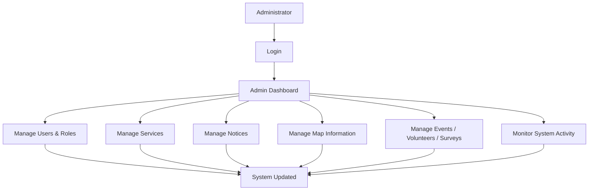
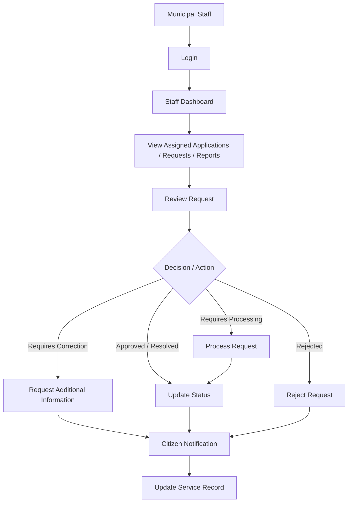
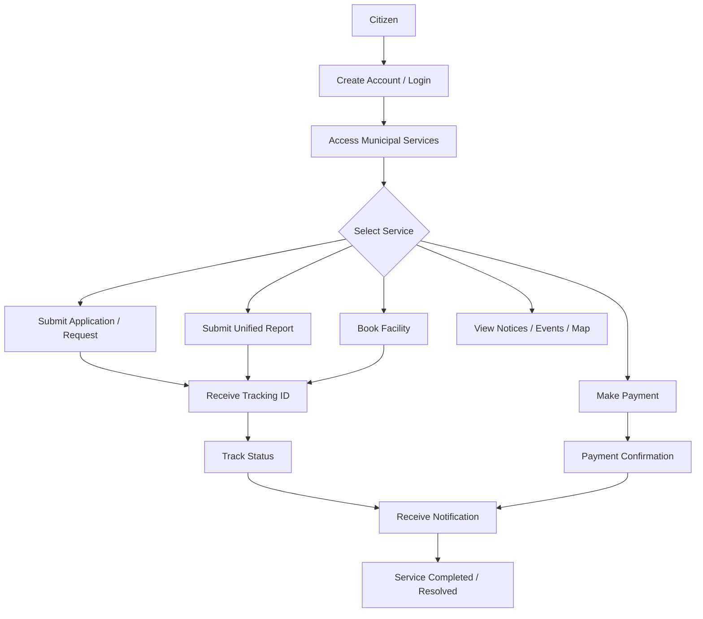
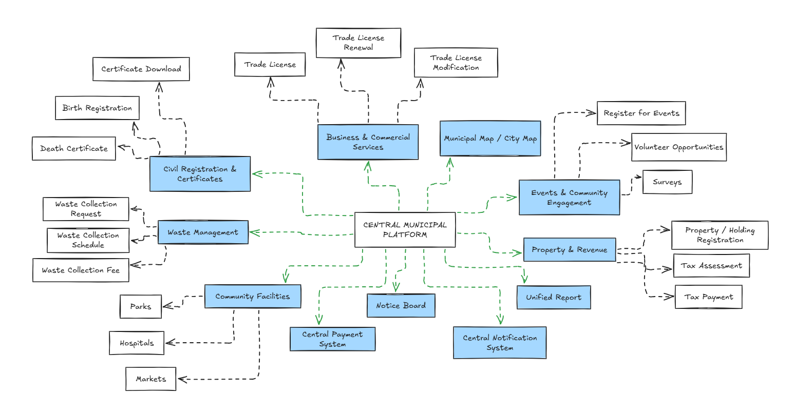
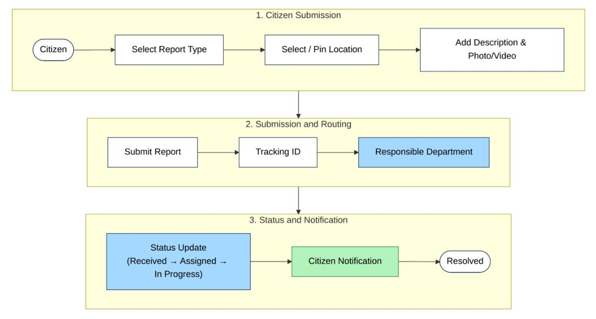
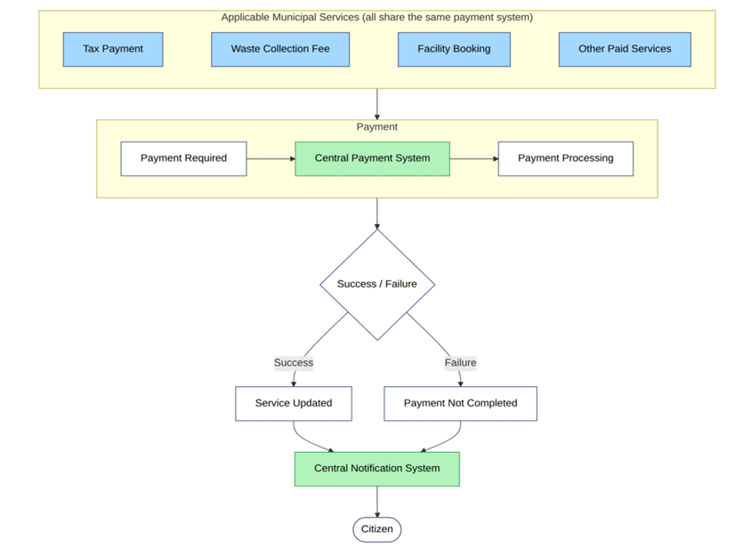
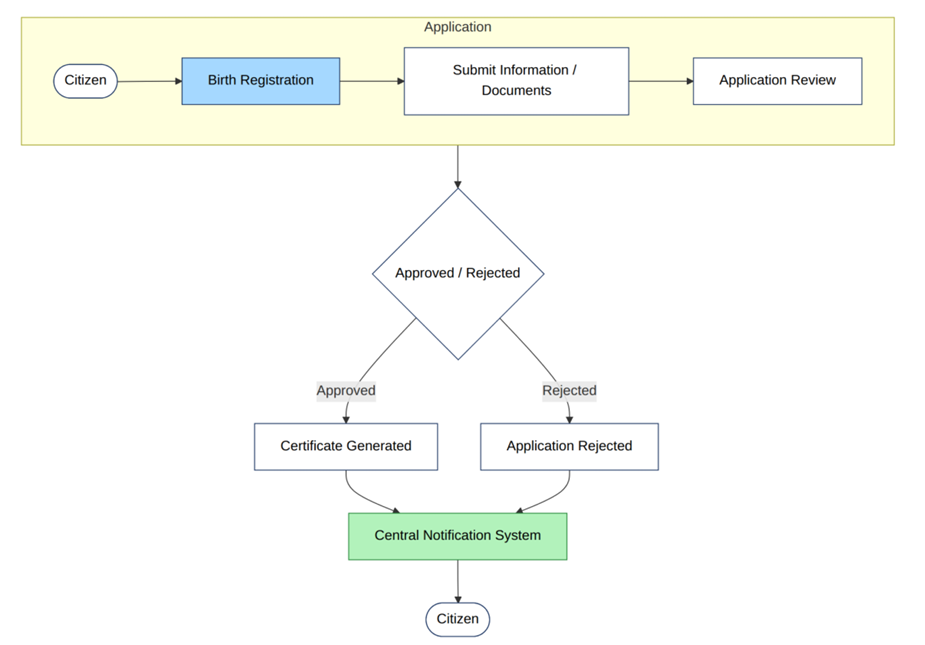
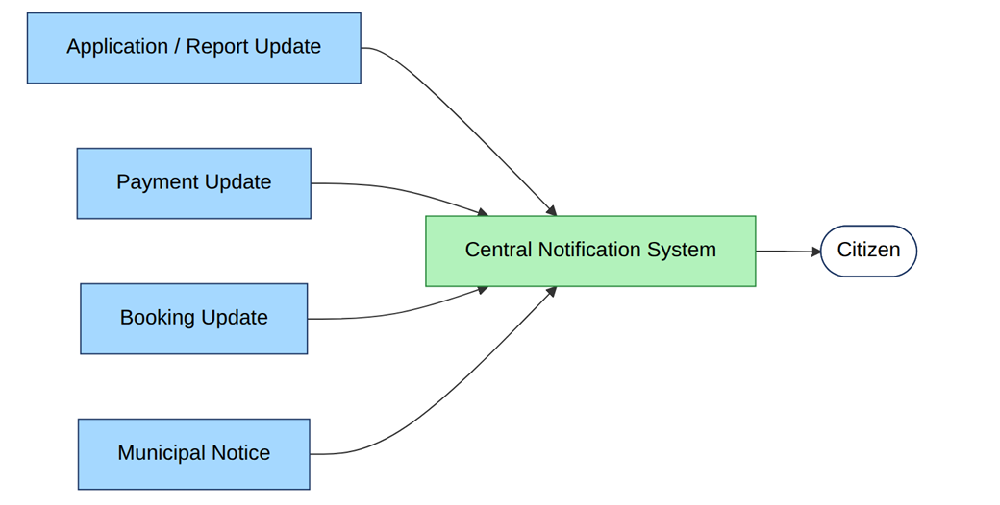

# SOFTWARE REQUIREMENTS SPECIFICATION

## Centralized Municipal Digital Platform

*A Unified Platform for Municipal Services, Reporting, Payments, Notifications and Information*

---

## Table of Contents

1. Introduction
   - 1.1 Purpose
   - 1.2 Problem Statement
   - 1.3 Objectives
   - 1.4 Scope
   - 1.5 System Overview
2. Overall Description
   - 2.1 Product Perspective
   - 2.2 User Classes & Characteristics
   - 2.3 Operating Environment
   - 2.4 General System Constraints
3. Functional Requirements
   - 3.1 Civil Registration & Certificates
   - 3.2 Business & Commercial Services
   - 3.3 Property & Revenue
   - 3.4 Unified Report
   - 3.5 Municipal Map / City Map
   - 3.6 Waste Management
   - 3.7 Community Facilities
   - 3.8 Events & Community Engagement
   - 3.9 Notice Board
   - 3.10 Central Payment System
   - 3.11 Central Notification System
4. Functional Specification
   - 4.1 Civil Registration & Certificates
   - 4.2 Business & Commercial Services
   - 4.3 Property & Revenue
   - 4.4 Unified Report
   - 4.5 Municipal Map / City Map
   - 4.6 Waste Management
   - 4.7 Community Facilities
   - 4.8 Events & Community Engagement
   - 4.9 Notice Board
   - 4.10 Central Payment System
   - 4.11 Central Notification System
5. Roles & Responsibilities
   - 5.1 Citizen
   - 5.2 Municipal Staff / Department
   - 5.3 Administrator
6. Role-Based Workflow
   - 6.1 Administrator Workflow
   - 6.2 Municipal Staff / Department Workflow
   - 6.3 Citizen Workflow
7. System Flow Diagram
   - 7.1 Overall System Flow
   - 7.2 Unified Report Workflow
   - 7.3 Central Payment Workflow
   - 7.4 Birth Registration Workflow
   - 7.5 Central Notification Workflow
8. Non-Functional Requirements
   - 8.1 Security
   - 8.2 Performance
   - 8.3 Usability
   - 8.4 Reliability
   - 8.5 Scalability
   - 8.6 Availability
   - 8.7 Accessibility
9. Future Scope
10. Conclusion

---

## 1. Introduction

### 1.1 Purpose

This Software Requirements Specification (SRS) describes the functional and non-functional requirements of the proposed Centralized Municipal Digital Platform (hereafter "the Platform"). It defines what the Platform should provide to its users and serves as a common reference for stakeholders, designers and evaluators of the proposal.

### 1.2 Problem Statement

Municipal services are commonly spread across multiple departments, each with its own procedures, counters and channels. Citizens must first work out which department handles a given service or problem before they can act. Reporting a problem, paying a fee, tracking an application and finding municipal information often involve separate processes, which leads to confusion, repeated visits, delays and limited transparency.

A single, centralized platform is needed so that citizens can access municipal services, report problems, make payments, receive updates and find municipal information in one place, while municipal departments process requests internally.

### 1.3 Objectives

- Provide one centralized citizen-facing platform for municipal services.
- Remove the need for citizens to identify the responsible department.
- Provide a Unified Report system for all municipal problems.
- Provide a Central Payment System for all applicable paid services.
- Provide a Central Notification System for status updates and notices.
- Provide an interactive municipal map with category-based information.
- Allow citizens to submit, track and receive updates on applications and requests.
- Improve transparency and communication between citizens and municipal authorities.

### 1.4 Scope

The Platform covers the following citizen-facing modules: Civil Registration & Certificates, Business & Commercial Services, Property & Revenue, Unified Report, Municipal Map / City Map, Waste Management, Community Facilities, Events & Community Engagement and Notice Board. These are supported by two shared services: the Central Payment System and the Central Notification System.

Internally, the Platform provides tools for Municipal Staff / Departments to process requests and for Administrators to manage the system. Technical architecture, database design and implementation technologies are outside the scope of this document.

### 1.5 System Overview

The Platform is a single point of access for municipal services. Citizens select a service or submit a report through one interface, without needing to know which department is responsible. Requests and reports are routed internally to the appropriate municipal unit, whose staff process them and update their status. Payments and notifications are handled through one central payment system and one central notification system, shared by all applicable modules. The overall flow is shown in Figure 1 (Section 7).

---

## 2. Overall Description

### 2.1 Product Perspective

The Platform is a new, standalone system proposed as the single digital entry point for municipal services. It is not an extension of any other system. All modules share common user accounts, a common payment system and a common notification system, so that citizens experience municipal services as one unified platform.

### 2.2 User Classes & Characteristics

| User Class | Description | Main Activities |
|---|---|---|
| Citizen | General public using municipal services. Technical skill varies widely. | Access services, submit applications and unified reports, make payments, track requests, view municipal information, receive notifications, participate in events and surveys. |
| Municipal Staff / Department | Municipal employees responsible for processing requests and handling reports for their department. | Receive and process applications, handle assigned reports, update request and report statuses, manage relevant services and information. |
| Administrator | Authorised personnel responsible for overall system management. | Manage users, municipal services, notices and municipal information; perform system-level monitoring and management. |

### 2.3 Operating Environment

- The Platform shall be accessible through modern web browsers on desktop computers, tablets and mobile devices.
- The Platform shall require an internet connection.
- Location-based features (current location, map pinning) require device location access, with manual map selection as an alternative.
- Staff and administrator functions shall be accessible through authorised accounts.

### 2.4 General System Constraints

- The Platform shall remain within the finalized scope defined in this document.
- All municipal problems shall be reported only through the Unified Report system; no module shall provide a separate reporting feature.
- All paid services shall use the Central Payment System only.
- All system notifications shall be delivered through the Central Notification System only.
- Services shall be subject to applicable municipal rules, fees and approval procedures.
- Citizen data shall be handled in accordance with applicable data protection and privacy requirements.

---

## 3. Functional Requirements

Requirements are grouped by module and identified as FR-01, FR-02 and so on. The word "shall" indicates a mandatory requirement.

### 3.1 Civil Registration & Certificates

This module allows citizens to apply for civil records and to verify and download issued certificates.

| ID | Requirement |
|---|---|
| FR-01 | The system shall allow citizens to submit a birth registration application online. |
| FR-02 | The system shall allow citizens to apply for a death certificate online. |
| FR-03 | The system shall allow citizens to verify the authenticity of an issued certificate. |
| FR-04 | The system shall allow citizens to download issued certificates in a printable format. |
| FR-05 | The system shall allow citizens to track the status of their applications. |

### 3.2 Business & Commercial Services

This module supports digital submission and management of trade-license-related services.

| ID | Requirement |
|---|---|
| FR-06 | The system shall allow citizens to apply for a new trade license online. |
| FR-07 | The system shall allow license holders to submit a trade license renewal request. |
| FR-08 | The system shall allow license holders to submit a trade license modification request. |
| FR-09 | The system shall allow applicants to upload required supporting documents. |
| FR-10 | The system shall allow applicants to track the status of trade license requests. |
| FR-11 | The system shall allow payment of applicable license fees through the Central Payment System. |

### 3.3 Property & Revenue

This module supports property registration and municipal tax processes.

| ID | Requirement |
|---|---|
| FR-12 | The system shall allow citizens to submit a property/holding registration request. |
| FR-13 | The system shall allow citizens to view the tax assessment for their registered property. |
| FR-14 | The system shall allow citizens to pay property tax through the Central Payment System. |
| FR-15 | The system shall allow citizens to request a tax clearance certificate. |
| FR-16 | The system shall allow citizens to download an issued tax clearance certificate. |

### 3.4 Unified Report

The Unified Report is the single reporting system for all municipal problems. Citizens select the problem type and submit the report without needing to know which department is responsible. The system routes each report internally to the responsible municipal unit based on report type and location.

| ID | Requirement |
|---|---|
| FR-17 | The system shall allow citizens to select a report type from a predefined list, including Road Damage, Pothole, Broken Streetlight, Drainage Problem, Waterlogging, Garbage, Illegal Dumping, Public Toilet Problem, Park/Playground Problem, Market Problem, Water Supply Problem and Other. |
| FR-18 | The system shall allow citizens to set the report location using their current location. |
| FR-19 | The system shall allow citizens to set the report location by pinning a point on a map. |
| FR-20 | The system shall allow citizens to add a text description to the report. |
| FR-21 | The system shall allow citizens to upload photo or video evidence. |
| FR-22 | The system shall generate a unique tracking ID when a report is submitted. |
| FR-23 | The system shall automatically route each report to the responsible municipal unit based on report type and location. |
| FR-24 | The system shall allow citizens to track report status using the tracking ID. |
| FR-25 | The system shall use the status sequence: Submitted → Received → Assigned → In Progress → Resolved. |
| FR-26 | The system shall allow municipal staff to view assigned reports and update their status. |

### 3.5 Municipal Map / City Map

This module provides an interactive map of municipal information organised by category.

| ID | Requirement |
|---|---|
| FR-27 | The system shall provide an interactive municipal map. |
| FR-28 | The system shall allow citizens to select categories/layers, such as Parks, Public Toilets, Hospitals, Markets, Municipal Infrastructure and other municipal locations. |
| FR-29 | The system shall display the locations and basic information for the selected categories on the map. |
| FR-30 | The system shall allow administrators and authorised staff to maintain map information. |

### 3.6 Waste Management

This module supports waste collection services. Waste-related problems are reported through the Unified Report system and not through this module.

| ID | Requirement |
|---|---|
| FR-31 | The system shall display waste collection schedules. |
| FR-32 | The system shall allow citizens to submit a waste collection request. |
| FR-33 | The system shall allow citizens to view and pay applicable waste collection fees through the Central Payment System. |
| FR-34 | The system shall allow citizens to track the status of waste collection requests. |

### 3.7 Community Facilities

This module provides information about municipal community facilities and, where applicable, supports their booking.

| ID | Requirement |
|---|---|
| FR-35 | The system shall provide information on Parks, Public Toilets, Hospitals and Public Auditoriums. |
| FR-36 | Where applicable, the system shall allow citizens to check facility availability. |
| FR-37 | Where applicable, the system shall allow citizens to book a facility. |
| FR-38 | Where a booking requires a fee, the system shall process payment through the Central Payment System. |
| FR-39 | The system shall send a booking confirmation through the Central Notification System. |

### 3.8 Events & Community Engagement

This module allows citizens to discover and participate in municipal and community activities.

| ID | Requirement |
|---|---|
| FR-40 | The system shall allow citizens to view municipal events and register for them. |
| FR-41 | The system shall allow citizens to view and apply for volunteer opportunities. |
| FR-42 | The system shall allow citizens to view and participate in surveys. |
| FR-43 | The system shall allow authorised staff to publish and manage events, volunteer opportunities and surveys. |

### 3.9 Notice Board

This module provides a centralized place for official municipal notices.

| ID | Requirement |
|---|---|
| FR-44 | The system shall display municipal notices published by authorised users. |
| FR-45 | The system shall allow citizens to filter notices by topic. |
| FR-46 | The system shall allow administrators to create, update and remove notices. |

### 3.10 Central Payment System

A single payment system is shared by all municipal services that require payment, such as Tax Payment, Waste Collection Fee, Facility Booking and other applicable paid services.

| ID | Requirement |
|---|---|
| FR-47 | The system shall provide one centralized payment facility for all applicable municipal services. |
| FR-48 | The system shall display the payable amount before payment is confirmed. |
| FR-49 | The system shall provide payment confirmation and a payment receipt to the citizen. |
| FR-50 | The system shall allow citizens to view their payment history. |
| FR-51 | The system shall update the status of the related service request after successful payment. |

### 3.11 Central Notification System

A single notification system is shared by all modules and delivers updates to citizens.

| ID | Requirement |
|---|---|
| FR-52 | The system shall provide one centralized notification system for all modules. |
| FR-53 | The system shall notify citizens of application and request status updates. |
| FR-54 | The system shall notify citizens of report status updates. |
| FR-55 | The system shall notify citizens of payment-related updates. |
| FR-56 | The system shall notify citizens of booking confirmations and updates. |
| FR-57 | The system shall notify citizens of important municipal notices. |

---

## 4. Functional Specification

This section explains each functional requirement defined in Section 3 in more detail, describing what the feature does, who uses it, how it fits into the overall service process, and why it is needed. The FR identifiers are the same as in Section 3, and the formal requirement statements are not repeated here.

### 4.1 Civil Registration & Certificates

FR-01: This feature allows citizens to submit birth registration applications online. The citizen enters the required information and provides the necessary documents through the Platform instead of visiting the municipal office. The submitted application is received by the responsible municipal staff, who review it and approve or reject it. By providing a digital channel for receiving and processing applications, the feature reduces manual procedures and makes the service more accessible.

FR-02: This feature allows citizens to apply for a death certificate online. A family member or other applicant submits the application through the Platform, and it is received by the responsible municipal staff for review and processing. This spares families from visiting the office during a difficult time and gives the municipality a structured, traceable way to handle such applications.

FR-03: This feature allows citizens to verify the authenticity of an issued certificate. It lets a citizen check that a certificate was genuinely issued by the municipality and has not been altered or forged. This is needed because certificates are often submitted to other organizations, and a reliable way to confirm their validity builds trust in the documents the municipality issues.

FR-04: This feature allows citizens to download issued certificates in a printable format. Once an application has been approved and the certificate generated, the citizen can obtain it directly from the Platform at any time and print it when needed. This removes the need to collect the certificate in person and lets citizens obtain additional copies without submitting a new request.

FR-05: This feature allows citizens to track the status of their applications. After submitting an application, the citizen can see its current stage, such as whether it is under review, approved or rejected. This provides transparency, reduces repeated visits and enquiries to the municipal office, and helps citizens know what to expect next.

### 4.2 Business & Commercial Services

FR-06: This feature allows citizens to apply for a new trade license online. A prospective business owner submits the application and its details through the Platform, and the responsible municipal staff review it. Making the first step of the licensing process available online reduces paperwork and travel for applicants and gives the municipality a consistent way to receive license applications.

FR-07: This feature allows license holders to submit a trade license renewal request. Business owners whose licenses are due for renewal can request it through the Platform instead of visiting the office. This helps businesses keep their licenses valid and gives the municipality an orderly process for handling renewals.

FR-08: This feature allows license holders to submit a trade license modification request. When something about an existing license needs to change, the license holder can formally request the change through the Platform. The request is reviewed by municipal staff, which ensures that changes to a license are recorded officially and can be traced.

FR-09: This feature allows applicants to upload the required supporting documents. Applicants for new licenses, renewals or modifications attach their documents to the request in digital form. Staff can then review the documents together with the request, which avoids the need to submit physical copies and keeps all information for a request in one place.

FR-10: This feature allows applicants to track the status of their trade license requests. Applicants can see how far a new license, renewal or modification request has progressed. This keeps them informed, reduces the need to contact the municipal office, and makes the licensing process more transparent.

FR-11: This feature allows applicants to pay applicable license fees through the Central Payment System. Where a license service carries a fee, the applicant sees the amount and pays it online through the same payment facility used by all municipal services. This makes fee payment convenient for applicants, and the related request is updated once payment succeeds.

### 4.3 Property & Revenue

FR-12: This feature allows citizens to submit a property or holding registration request. Property owners use it to register their property with the municipality through the Platform, and municipal staff review the request. Registration is the basis for property tax assessment, so a digital process helps the municipality maintain accurate property records and makes registration easier for owners.

FR-13: This feature allows citizens to view the tax assessment for their registered property. Property owners can see the tax amount assessed for their property through the Platform. This makes it clear what they owe, supports transparency in municipal taxation, and reduces the need to visit the office just to find out the amount.

FR-14: This feature allows citizens to pay property tax through the Central Payment System. After viewing the assessment, the owner can pay the tax online using the shared payment facility. This makes payment convenient for citizens and supports timely and well-recorded revenue collection for the municipality.

FR-15: This feature allows citizens to request a tax clearance certificate. A property owner who needs proof that their municipal taxes have been settled can submit a request through the Platform, and municipal staff process it. This gives owners an official way to obtain such proof without visiting the office in person.

FR-16: This feature allows citizens to download an issued tax clearance certificate. When the municipality has issued the certificate, the owner can obtain it directly from the Platform. This provides immediate access to the document and avoids the need to collect it in person.

### 4.4 Unified Report

FR-17: This feature allows citizens to select the type of problem they are reporting from a predefined list, such as Road Damage, Pothole, Broken Streetlight, Drainage Problem, Waterlogging, Garbage, Illegal Dumping, Public Toilet Problem, Park/Playground Problem, Market Problem, Water Supply Problem or Other. Citizens do not need to know which municipal department handles a given problem; they only choose the category that best describes it. The selected type is later used to direct the report to the right municipal unit, and the list gives the municipality consistent categories for handling problems.

FR-18: This feature allows citizens to set the location of a report using their current location. When the citizen is at the site of the problem, the Platform can use the device's location so the citizen does not have to describe or find the place manually. This gives staff an accurate location and makes reporting quicker for the citizen.

FR-19: This feature allows citizens to set the location of a report by pinning a point on a map. It is useful when the citizen is not at the site, or when device location is unavailable, because the citizen can select the problem site manually. A precise map location helps staff find the problem and, together with the report type, supports directing the report to the responsible unit.

FR-20: This feature allows citizens to add a text description to the report. The citizen explains the problem in their own words, adding details that the report type and location alone cannot convey. This helps municipal staff understand the nature and seriousness of the problem and decide how to address it.

FR-21: This feature allows citizens to upload photo or video evidence. Citizens can attach images or recordings that show the problem as it is. This helps staff verify and assess the report more easily and reduces the need for follow-up questions to the citizen.

FR-22: This feature generates a unique tracking ID when a report is submitted. The citizen receives this ID as a reference for the report, and the municipality can use it to identify the report without confusion with others. It is needed so that each report can be followed individually from submission to resolution.

FR-23: This feature automatically routes each report to the responsible municipal unit based on the report type and location. This is the step that lets citizens report problems without knowing which department is responsible, because the Platform performs the routing internally. It reduces delays caused by reports reaching the wrong office and means staff receive the reports that belong to their unit.

FR-24: This feature allows citizens to track the status of a report using its tracking ID. The citizen enters the ID to see where the report currently stands in the process. This improves transparency and lets citizens follow progress without contacting the municipality.

FR-25: This feature defines the status sequence that every report follows: Submitted, Received, Assigned, In Progress and Resolved. The same stages apply to all report types, so citizens and municipal staff share one clear understanding of how far a report has progressed. A fixed sequence also keeps the status shown to citizens consistent with the work being done.

FR-26: This feature allows municipal staff to view the reports assigned to them and update their status. Staff of the responsible unit see the reports routed to them and move each report through the status sequence as they handle it. This lets staff manage their workload and ensures that citizens are informed as the report progresses to resolution.

### 4.5 Municipal Map / City Map

FR-27: This feature provides an interactive municipal map. Citizens can open the map to explore the municipality visually and find municipal locations and information in one place. Presenting this information on a map is easier to use than separate lists or notices and helps citizens find what they need without visiting the office.

FR-28: This feature allows citizens to select categories or layers on the map, such as Parks, Public Toilets, Hospitals, Markets, Municipal Infrastructure and other municipal locations. By choosing what to display, citizens can concentrate on the type of place they are looking for and avoid a cluttered map. This makes the map practical for many different needs.

FR-29: This feature displays the locations and basic information for the selected categories on the map. When a category is chosen, the places belonging to it are shown with basic information about each one. This helps citizens find nearby facilities and learn about them quickly.

FR-30: This feature allows administrators and authorised staff to maintain the map information. They add, update or correct the places and details shown on the map as the municipality changes. This keeps the map accurate and up to date, which is necessary for citizens to rely on it.

### 4.6 Waste Management

FR-31: This feature displays waste collection schedules. Citizens can look up when waste collection takes place so they can put out their waste at the right time. It helps keep neighbourhoods clean and reduces enquiries to the municipality about collection times.

FR-32: This feature allows citizens to submit a waste collection request. Citizens use it when they need a waste collection service and submit the request through the Platform. The municipality receives these requests in an organized way and can plan and carry out the service accordingly. Waste-related problems such as Garbage or Illegal Dumping are not handled here but are submitted through the Unified Report.

FR-33: This feature allows citizens to view and pay applicable waste collection fees through the Central Payment System. Citizens can see the fee that applies to them and pay it online using the shared payment facility. This makes fee payment convenient and keeps waste collection payments consistent with the other paid municipal services.

FR-34: This feature allows citizens to track the status of their waste collection requests. Citizens can see whether a request has been received, is being handled or has been completed. This keeps them informed and reduces the need to contact the municipality about their requests.

### 4.7 Community Facilities

FR-35: This feature provides citizens with information on Parks, Public Toilets, Hospitals and Public Auditoriums. Citizens can learn about these municipal facilities through the Platform instead of asking at the municipal office. Having this information in one place helps citizens find and use public facilities.

FR-36: This feature allows citizens to check the availability of a facility, where applicable. For facilities that can be booked, such as public auditoriums, citizens can see whether the facility is available before deciding to book. This helps them plan their use of the facility and avoids unnecessary visits or requests.

FR-37: This feature allows citizens to book a facility, where applicable. A citizen who wants to use a facility that supports booking can reserve it through the Platform. This provides a convenient and organized way to reserve municipal facilities without visiting the office.

FR-38: This feature processes payment through the Central Payment System when a booking requires a fee. If the facility carries a charge, the citizen pays through the same shared payment facility used by other municipal services before the booking is finalized. This allows the booking to be completed online and keeps fee collection consistent.

FR-39: This feature sends a booking confirmation to the citizen through the Central Notification System. After a booking is made, the citizen receives a notification confirming it. This assures the citizen that the booking has been recorded and serves as a reference for later use.

### 4.8 Events & Community Engagement

FR-40: This feature allows citizens to view municipal events and register for them. Citizens can see which events the municipality is organizing and sign up to take part through the Platform. This helps the municipality reach residents, supports attendance planning, and encourages participation in community life.

FR-41: This feature allows citizens to view and apply for volunteer opportunities. Citizens who want to contribute to municipal or community activities can see the available opportunities and apply for them. It connects willing residents with activities that need volunteers and strengthens community involvement.

FR-42: This feature allows citizens to view and participate in surveys. Citizens can see the surveys published by the municipality and submit their responses through the Platform. This gives residents a way to express their views and gives the municipality input from the community.

FR-43: This feature allows authorised staff to publish and manage events, volunteer opportunities and surveys. These users create the content that citizens see and keep it current by updating or managing it as needed. Without this, the municipality could not offer citizens any engagement activities through the Platform.

### 4.9 Notice Board

FR-44: This feature displays municipal notices published by authorised users. Citizens can read official announcements from the municipality in one central place rather than looking for them in separate locations. This ensures that citizens can find reliable and official information.

FR-45: This feature allows citizens to filter notices by topic. As the number of notices grows, citizens can narrow the list to the topics that interest them. This helps them find relevant information quickly and avoids searching through unrelated notices.

FR-46: This feature allows administrators to create, update and remove notices. Administrators control what appears on the Notice Board, adding new notices, correcting existing ones and removing those that are no longer valid. This keeps the notice board accurate and trustworthy for citizens.

### 4.10 Central Payment System

FR-47: This feature provides one centralized payment facility for all applicable municipal services. Whenever a service requires payment, such as property tax, waste collection fees, facility bookings or other paid services, the citizen pays through this same facility. Using a single payment system gives citizens a consistent experience and avoids separate payment processes for each module.

FR-48: This feature displays the payable amount before payment is confirmed. The citizen sees exactly how much they are about to pay and can review it before completing the payment. This helps prevent mistakes and builds trust in the payment process.

FR-49: This feature provides a payment confirmation and a payment receipt to the citizen. After a payment is completed, the citizen is told that it went through and receives a receipt as proof. The receipt serves as the citizen's record of payment for any later reference.

FR-50: This feature allows citizens to view their payment history. Citizens can look back at the payments they have made through the Platform. This lets them check past payments and keep track of what they have paid without requesting records from the municipality.

FR-51: This feature updates the status of the related service request after successful payment. For example, a request that was waiting for payment moves forward once the payment is completed. This ensures that the service process continues without manual intervention and that citizens and staff see the correct current status.

### 4.11 Central Notification System

FR-52: This feature provides one centralized notification system for all modules. Every update that needs to reach a citizen is delivered through this single system, regardless of the service involved. This gives citizens a consistent way of receiving updates and avoids separate notification mechanisms in each module.

FR-53: This feature notifies citizens of application and request status updates. When municipal staff change the status of an application or request, the citizen is informed without having to check repeatedly. This keeps citizens aware of progress, such as approval, rejection or a request for additional information.

FR-54: This feature notifies citizens of report status updates. As a Unified Report moves through the stages from Submitted to Resolved, the citizen who submitted it is informed of the changes. This keeps citizens aware of what is happening with their reported problem and encourages trust in the process.

FR-55: This feature notifies citizens of payment-related updates. After a payment attempt, the citizen is informed of its outcome, whether it was successful or not. This makes sure citizens know the result of their payment and can act if it was not completed.

FR-56: This feature notifies citizens of booking confirmations and updates. Citizens who book a facility are informed about the confirmation of the booking and any later changes related to it. This helps them stay informed about their reservations.

FR-57: This feature notifies citizens of important municipal notices. Where a municipal notice is important, citizens are informed of it through the notification system rather than relying on checking the Notice Board themselves. This helps ensure that important announcements reach the citizens who need them.

---

## 5. Roles & Responsibilities

The Platform has three primary user roles: Citizen, Municipal Staff / Department and Administrator. Access to each function is governed by role-based access control (see Section 8.1). The responsibilities of each role are summarised below.

### 5.1 Citizen

The Citizen is a member of the public who uses the Platform to access municipal services and information. Responsibilities:

- Create an account and access municipal services.
- Submit applications and service requests.
- Submit Unified Reports for municipal problems.
- Make payments through the Central Payment System.
- Book applicable community facilities.
- Track applications, requests and reports.
- View municipal notices, events, surveys and map information.
- Receive notifications and service updates.

### 5.2 Municipal Staff / Department

Municipal Staff / Department is a single role. Individual departments (for example, those handling tax, trade licenses or waste) are organizational units within this role and not separate roles. Responsibilities:

- Log in to the staff dashboard.
- View applications, requests and reports assigned to their department/unit.
- Review and process submitted requests.
- Request additional information or corrections when required.
- Approve, reject or update request status according to their responsibility.
- Handle assigned Unified Reports and update their status.
- Keep service records updated.
- Respond to citizen requests through the platform.

### 5.3 Administrator

The Administrator is the authorised person responsible for overall system management. Responsibilities:

- Manage users and roles.
- Manage municipal services and system configuration.
- Manage municipal notices.
- Maintain municipal map information.
- Manage events, volunteer opportunities and surveys.
- Monitor overall system activity.
- Maintain the overall operation of the platform.

---

## 6. Role-Based Workflow

This section presents the primary interaction of each system role with the Platform. The workflows are representative and do not describe every possible service process.

### 6.1 Administrator Workflow

*Figure 6: Administrator Workflow*

The administrator manages the Platform, its users, service configuration, public information and overall system activity.

### 6.2 Municipal Staff / Department Workflow

*Figure 7: Municipal Staff / Department Workflow*

Municipal staff process applications, service requests and reports assigned to their respective departments/units and update the service record so that citizens can receive the relevant status information.

### 6.3 Citizen Workflow

*Figure 8: Citizen Workflow*

Citizens use the Platform as the primary entry point for municipal services, including applications, reports, payments, facility booking, tracking and access to municipal information.

---

## 7. System Flow Diagram

This section presents the overall flow of the Platform (Figure 1) followed by four representative workflows (Figures 2 to 5). The representative workflows illustrate the shared services of the Platform and are not provided for every module.

### 7.1 Overall System Flow

Figure 1 shows the overall flow of the Platform. The Central Municipal Platform is the single entry point, from which citizens reach each service module, the Central Payment System and the Central Notification System.

*Figure 1: Overall System Flow Diagram*

**Citizen interaction.** Citizens access the Central Municipal Platform and choose the required module, such as a certificate, trade license, property service, waste service, facility, event or the Unified Report. They do not need to identify the responsible department. They can also view the Municipal Map and the Notice Board directly.

**Internal processing.** Applications and requests submitted through the modules, and reports submitted through the Unified Report, are routed internally to the responsible municipal department or unit. Municipal staff receive these items, process them and update their status.

**Shared services.** Services that require payment use the Central Payment System. Status changes, payment updates, booking confirmations and important notices are delivered to citizens through the Central Notification System.

### 7.2 Unified Report Workflow

*Figure 2: Unified Report Workflow*

The citizen selects a report type, sets the location by current location or map pin, adds a description with optional photo or video evidence, and submits the report. The system generates a tracking ID and routes the report to the responsible department based on report type and location. The department updates the status, the citizen is notified through the Central Notification System, and the report is closed as Resolved.

### 7.3 Central Payment Workflow

*Figure 3: Central Payment Workflow*

All applicable municipal services, such as Tax Payment, Waste Collection Fee and Facility Booking, use the same Central Payment System rather than separate payment systems. When payment is required, the system processes it and the result is either success or failure. On success the related service is updated. In both cases the citizen is informed of the payment outcome through the Central Notification System.

### 7.4 Birth Registration Workflow

*Figure 4: Birth Registration Workflow*

This high-level workflow shows how a citizen-submitted application is handled. The citizen submits the required information and documents for birth registration, and the application is reviewed by the responsible municipal staff. If approved, a certificate is generated; if rejected, the application is marked as rejected. The outcome is communicated to the citizen through the Central Notification System.

### 7.5 Central Notification Workflow

*Figure 5: Central Notification Workflow*

Application and report updates, payment updates, booking updates and municipal notices all feed into the single Central Notification System, which delivers them to the citizen. No module has its own separate notification system.

---

## 8. Non-Functional Requirements

### 8.1 Security

- The system shall require authenticated access for personal applications, payments and reports.
- The system shall enforce role-based access control for citizens, municipal staff and administrators.
- The system shall protect personal and payment data during transmission and storage.
- The system shall maintain activity logs for key staff and administrator actions.

### 8.2 Performance

- Common pages shall load within an acceptable time (target: within 3 seconds under normal load).
- The system shall support multiple concurrent users without noticeable degradation.
- Uploads of photo and video evidence shall complete within a reasonable time on typical connections.

### 8.3 Usability

- The interface shall be simple, consistent and usable by citizens with limited technical experience.
- Service names and navigation shall be clear so that citizens can find services without knowing municipal departments.
- The system shall provide clear messages for errors and successful actions.
- The system should support both Bangla and English.

### 8.4 Reliability

- The system shall not lose submitted applications, reports or payment records.
- The system shall maintain regular data backups and recovery procedures.
- Request and report statuses shall always be consistent with processing actions.

### 8.5 Scalability

- The system shall support growth in the number of users, requests and reports.
- New service categories and report types shall be addable without major redesign.

### 8.6 Availability

- The system shall target high availability (for example, 99% uptime) excluding planned maintenance.
- Planned maintenance shall be announced in advance.

### 8.7 Accessibility

- The system shall be usable on mobile phones, tablets and desktop browsers.
- The interface shall follow common accessibility practices, such as readable text, sufficient colour contrast and keyboard navigation.

---

## 9. Future Scope

The following extensions naturally follow from the proposed Platform and may be considered in later versions:

- A dedicated mobile application for citizens.
- Additional notification channels, such as SMS and push notifications.
- Analytics dashboards for municipal management based on request and report data.
- Expansion of the Municipal Map with additional categories and layers.
- Additional online municipal services and payment options as the municipality requires.

---

## 10. Conclusion

The proposed Centralized Municipal Digital Platform brings municipal services into one place. Citizens can apply for services, submit all problem reports through the Unified Report, pay through one Central Payment System, receive updates through one Central Notification System, find information on the Municipal Map and Notice Board, and track their requests. Departments process requests internally, so citizens no longer need to know which department is responsible. The result is easier access, clearer communication and greater transparency in municipal service delivery.